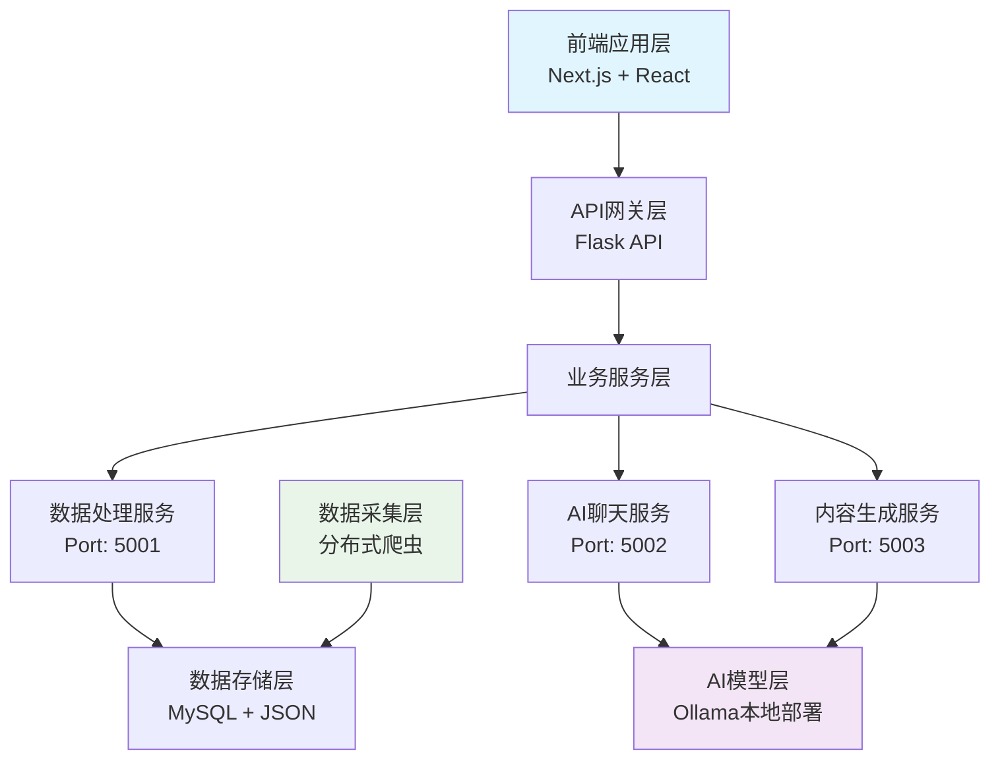

# 千寻灵犀

<div align="center">


**基于AI面向内容创作者的智能内容创作平台，让创意无限可能**

</div>

---

##  项目亮点

> **突破传统创作边界，用AI重新定义内容创作**

-  **实时热点捕获** - 多平台热点数据实时抓取与分析
- **智能创意生成** - 基于用户画像的个性化内容创作方案
- **AI智能对话** - 本地部署大语言模型，专业创作咨询
-  **数据驱动洞察** - 深度分析热点趋势，发现创作机会
-  **个性化画像** - 多维度用户标签系统，精准匹配创作风格

##  核心功能

###  热点数据中心
- **多平台覆盖**: 微博、抖音、B站、小红书等主流平台
- **实时更新**: 自动化爬虫系统，确保数据时效性
- **智能分类**: 按平台、类别、热度等多维度筛选
- **趋势分析**: AI分析热点背后的传播规律

###  智能用户画像
- **标签体系**: 涵盖兴趣、行业、风格等多个维度
- **自定义标签**: 支持用户个性化标签添加
- **动态优化**: 基于使用行为持续优化画像精度
- **创作匹配**: 智能匹配最适合的创作方向

###  AI创意引擎
- **多角度创意**: 反常规思维、跨界融合、情感共鸣等8种创意策略
- **个性化生成**: 基于用户画像定制化内容方案
- **批量生成**: 一次生成多个创意方案供选择
- **质量保证**: 内置内容质量评估机制

###  智能对话助手
- **本地部署**: 基于Ollama的本地大语言模型
- **专业咨询**: 针对创作问题的专业解答
- **上下文理解**: 支持多轮对话，理解创作需求
- **知识增强**: 结合平台数据提供精准建议

##  技术架构

### 前端技术栈
```
Next.js 14 + React 18 + TypeScript
├── UI框架: TailwindCSS + ShadCN UI
├── 状态管理: React Hooks
├── 构建工具: Webpack 5
└── 开发工具: ESLint + Prettier
```

### 后端技术栈
```
Python 3.9+ 微服务架构
├── API框架: Flask + Flask-CORS
├── 数据采集: Scrapy + Requests + Schedule
├── AI模型: Ollama (Qwen2.5-3B + DeepSeek-R1-1.5B)
├── 数据存储: MySQL + JSON文件
└── 任务调度: 定时任务系统
```

### 系统架构图


##  快速开始

### 环境要求
- Node.js 18+
- Python 3.9+
- MySQL 8.0
- Ollama (用于AI模型部署)

### 安装步骤

1. **克隆项目**
```bash
git clone https://github.com/your-username/ai-content-creator.git
cd ai-content-creator
```

2. **前端环境配置**
```bash
# 安装依赖
npm install
# 或使用 yarn
yarn install

# 启动开发服务器
npm run dev
```

3. **后端环境配置**
```bash
# 进入后端目录
cd backEnd

# 安装Python依赖
pip install -r requirements.txt

# 启动所有后端服务
cd api
python start_services.py
```

4. **AI模型部署**
```bash
# 安装Ollama
curl -fsSL https://ollama.ai/install.sh | sh

# 下载模型
ollama pull qwen2.5:3b
ollama pull deepseek-r1:1.5b
```

5. **访问应用**
- 前端应用: http://localhost:3000
- 数据API: http://localhost:5001
- AI聊天API: http://localhost:5002
- 内容生成API: http://localhost:5003

##  使用指南

### 1. 构建用户画像
- 选择感兴趣的标签（科技、娱乐、教育等）
- 添加自定义标签描述个人特色
- 填写详细的用户描述信息

### 2. 获取创作灵感
- 浏览实时热点数据
- 使用AI分析功能深度解读热点
- 基于个人画像生成创作方案

### 3. AI智能对话
- 询问创作相关问题
- 获取专业的内容策略建议
- 探讨热点话题的创作角度

### 4. 数据源管理
- 查看各平台数据统计
- 了解数据更新时间
- 监控数据质量状态

## 原型设计

<div align="center">

### 主页 - 热点数据展示


### 分类数据源


### 一键创意


### 灵犀对话


### 用户画像 - 个性化配置


</div>

##  项目数据

- **支持平台**: 10+ 主流内容平台
- **数据更新**: 每小时自动更新
- **AI模型**: 2个专业优化模型
- **响应速度**: < 2秒内容生成
- **准确率**: 85%+ 创意匹配度

##  开发指南

### 项目结构
```
ai-content-creator/
├── app/                    # Next.js前端应用
│   ├── components/         # React组件
│   ├── api/               # API路由
│   └── globals.css        # 全局样式
├── backEnd/               # Python后端服务
│   ├── api/               # API服务
│   ├── crawl/             # 数据爬虫
│   ├── result/            # 数据结果
│   └── requirements.txt   # Python依赖
├── lib/                   # 工具库
└── public/                # 静态资源
```

### 开发规范
- **代码风格**: ESLint + Prettier
- **提交规范**: Conventional Commits
- **分支策略**: Git Flow
- **测试覆盖**: 单元测试 + 集成测试

##  贡献指南

我们欢迎所有形式的贡献！

1. Fork 项目
2. 创建特性分支 (`git checkout -b feature/AmazingFeature`)
3. 提交更改 (`git commit -m 'Add some AmazingFeature'`)
4. 推送到分支 (`git push origin feature/AmazingFeature`)
5. 开启 Pull Request

##  开源协议

本项目基于 [MIT License](LICENSE) 开源协议。

---

<div align="center">

**⭐ 如果这个项目对你有帮助，请给我们一个Star！**

Made with ❤️ by AI Content Creator Team

</div>